
** LOS ALAMOS NATIONAL LABORATORY EARTHQUAKE PREDICTION**

Submitted in partial fulfillment for the award of **Post Graduate Diploma in Big Data Analytics** from **C-DAC**  

**Advanced Computing Training School (Pune,India)** 

Presented By 

**Mr. Vaibhav Kulkarni** 

**CENTRE FOR DEVELOPMENT OF ADVANCED COMPUTING (C-DAC),PUNE** 

CERTIFICATE 

**TO WHOMSOEVER IT MAY CONCERN This is to certify that** 

` `**Mr. Vaibhav Kulkarni**

**has successfully completed the project on** 

**EARTHQUAK EPREDICTION**

**HOD ACTS** 

**Mr. Aditya Kumar Sinha**

**ACKNOWLEDGEMENT** 

This project “**Earthquake Prediction**” was a great learning experience for us and we are submitting this work to Advanced Computing Training School (CDAC ACTS).

We all are very glad to mention the name of **Mr*.*Prateek Maheshwari** for his valuable guidance  to  work  on this  project.  His  guidance  and  support  helped  us  to  overcome various obstacles and intricacies during the course of project work. 

We are highly grateful to **Ms. Risha P.R.** (Manager (ACTS training Centre), C-DAC), for her guidance and support whenever necessary while doing this course Post Graduate Diploma in Big Data Analytics* through C-DAC ACTS, Pune.

Our most heartfelt thanks goes to  **Ms. Shilpi Shalini** (Course Coordinator, PG-DBDA) who gave all the required support and kind coordination to provide all the* necessities like required hardware, internet facility and extra Lab hours to complete the project and throughout the course up to the last day here in C-DAC ACTS, Pune. 

Sincere thanks to CDAC ACTS for supporting us with the provision of high computing resources, **Param Shavak.**

## Table of Content 
1. Abstract 
2. Introduction and Overview 
   1. Problem Statement 
   2. Problem Statement Analysis 
   3. Domain Research 
3. System Requirements 
   1. Hardware Requirements 
   2. Software Requirements 
4. Data Exploration 
5. Feature Engineering 
6. Modeling 
7. Scikit Learn Based 
   1. Linear Regressor 
   2. Support Vector Regression(SVR) 
   3. Decision Tree 
   4. Multilayer PerceptronRegressor(MLP) 
   5. Random Forest 
   6. XGBoost 
   7. Long short-term memory Neural Network(RNN-LSTM) 
   8. Voting 
   9. Stacking 
8. H2O Based 
   1. Generalized Linear Model(GLM) 
   2. Deep Learning(Neural Networks) 
   3. Gradient Boosting Machine(GBM) 
   4. XGBoost 
   5. Distributed Random Forest (DRF) 
   6. Stack Ensemble 
9. Conclusion 
10. Future Scope 

## Abstract

Forecasting earthquakes is one of the most important problems in Earth science because of their devastating consequences. Current scientific studies related to earthquake forecasting focus on three key points: when the event will occur, where it will occur, and how large it will be. 

In this project, we have addressed when the earthquake will take place. Specifically, we have predicted the time remaining before laboratory earthquakes occur from real-time seismic data. 

Further analyzing the given data and after a domain research, we transformed the existing data at our disposal into a set of features consisting variance which represented the original data. The objective behind the data transformation was to convert huge data into a much manageable size. Machine learning was the fundamental tool used in developing a solution to this problem. Domain research brought out the key  understanding  that earthquakes occur  in  patterns,  and  these  patterns  are  usually  found  in  the seismographic readings. To capture these patterns we divided the seismic data into segments of large size. Then converted these segments into set of features.  Analyzing the seismic data and relative time to failure, we plotted a relation that showed a correlation between the two. These set of features with multiple segment size were used as training sets for various Machine Learning algorithms. Carrying out all the possible combinations with parameter tuning we were able to achieve rank 2021 on Kaggle private leader board. 

## Introduction and Overview
One of the most crucial jobs of modern IT world includes handling and computing humongous amounts of data. Data, which can yield valuable insights, extrapolate trends and help with the prediction of particular features. To extract such insights or predict values depending upon the existing data manually is practically impossible let alone analyze the data. The tool that enables us to achieve these things is Machine Learning. Machine learning has the potential to work with complex as well as large amount of data  and  can  produce  astonishing  results.  Developing  ML  algorithms  and  building  the  model  and implementing it over a data can turn out to be an extremely complex and tedious task. Especially when the data is in terms of Gigabytes or Terabytes. Hence, we depend upon various other factors while implementing  Machine  Learning.  Factors  such  as  type  of  data,  type  of  prediction  (Classification, Regression), number of predictors, size of data, type of learning (supervised, unsupervised, reinforced) help to narrow down to a specific type of Machine Learning model development process. 

Algorithm development or selection of algorithm is the next crucial step in ML implementation, we can develop a new algorithm, which will work in a specific environment, or we can go with the existing algorithms, which suit our prediction case. In recent  years, even the implementation of models has changed. To deal with the complex data and reduce the computing time ML now enables some algorithms to run in a parallel manner, which reduces the execution time drastically.  

Domain knowledge helps in understanding the requirements and constraints. This can also be a deciding factor when selecting a ML algorithm. This selection process, after a proper tuning of model can produce a solution targeted to our problem. 

The basic process of machine learning is to give training data to a learning algorithm. The learning algorithm then generates a new set of rules, based on inferences from the data. This is in essence generating a new algorithm, formally referred to as the  machine-learning model. By using different training data, the same learning algorithm could be used to generate different models. For example, the same type of learning algorithm could be used to teach the computer how to translate languages or predict the stock market. 

Inferring new instructions from data is the core strength of machine learning. It also highlights the critical role of data: the more data available to train the algorithm, the more it learns. In fact, many recent advances in AI have not been due to radical innovations in learning algorithms, but rather by the enormous amount of data enabled by the Internet  

**How machines learn:**  

Although a machine learning model may apply a mix of different techniques, the methods for learning can typically be categorized as three general types: 

**Supervised learning:** The learning algorithm is given labeled data and the desired output. For example, pictures of dogs labeled “dog” will help the algorithm identify the rules to classify pictures of dogs. 

**Unsupervised learning:** The data given to the learning algorithm is unlabeled, and the algorithm is asked to identify patterns in the input data. For example, the recommendation system of an e-commerce website where the learning algorithm discovers similar items often bought together. 

**Reinforcement learning:** The algorithm interacts with a dynamic environment that provides feedback in terms of rewards and punishments. For example, self-driving cars being rewarded to stay on the road. 

## Problem Statement:

Forecasting earthquakes is one of the most important problems in Earth science because of their devastating consequences. Current scientific studies related to earthquake forecasting focus on three key points: when the event will occur, where it will occur, and how large it will be. 

In this project, we will address when the earthquake will take place. Specifically, we will predict the time remaining before laboratory earthquakes occur from real-time seismic data.** 

**Problem Statement Analysis:** 

The  objective  of  this  project  is  to  use  seismic  signals  to  predict  the  timing  of  laboratory earthquakes. The data comes from a well-known experimental set-up used to study earthquake physics. The (acoustic\_data) input  signal  is  used  to  predict  the  time  remaining  before  the  next  laboratory earthquake (time\_to\_failure). 

The training data is a single, continuous segment of experimental data. The test data consists of a folder containing many small segments. The data *within* each test file is continuous, but the test files do not represent a continuous segment of the experiment; thus, the predictions cannot be assumed to follow the same regular pattern seen in the training file. 

For each seg\_id in the test folder, we should predict a *single* time\_to\_failure corresponding to the time between the *last* row of the segment and the next laboratory earthquake. 

acoustic\_data - the seismic signal  

time\_to\_failure - the time (in seconds) until the next laboratory earthquake  

seg\_id - the test segment ids for which predictions should be made (one prediction per segment) 

**Domain Research:** 

An earthquake is caused by slip on a fault. Seismic slip motion involves a broad 'period' (or frequency) range, at least from 0.1 s to 1 hour, and a wide range of amplitudes, roughly from one µm to 30 m. Most seismographs available before the 1960s could record ground motions over only short periods 

- less  than  30  s  —  which  prevented  seismologists  from  studying  important  details  of  earthquake processes. In the 1960s, longer-period analogue seismographs became available, allowing seismologists to study great earthquakes (in general, magnitude ≥ 8) over an extended period range; this has resulted in substantial progress in our understanding of earthquakes. For example, being able to measure long- period waves of up to 1 hour has made it possible for seismologists to establish the overall size of great earthquakes accurately. With the old instruments, wave amplitudes were measured over only a short period range, leading to underestimates of the magnitude of great earthquakes. 

## System Requirements

**Hardware Requirements:**

1. Core i7, 16 GB Ram, 500 GB HDD.** 
2. **PARAM Shavak** **HCP**- 64GB Ram, 8TB HDD, 28 core Intel Xeon.** 
3. **PARAM Shavak** **DL GPU**- 64GB Ram, 8TB HDD, x86 based latest Intel processor, NVidia Pascal architecture based co-processing technologies (P5000/P6000).** 

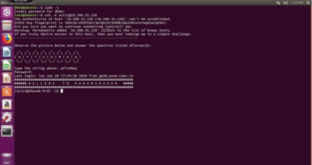

**Software Requirements:**

1. Anaconda, MiniConda.** 
1. Tableau.** 
1. Windows 7.** 
1. Ubuntu.** 
1. Jupyter Notebook.** 
1. Sypder IDE.** 

## Data Exploration

If you see the following graph on the same sharable axis, we have plotted the acoustic data and time\_to\_failure with the x-axis is the number of rows. If you observe the graph, there are complex oscillations of the acoustic\_data but before each earthquake, we observe a sudden rise in the amplitude of the acoustic signal. 

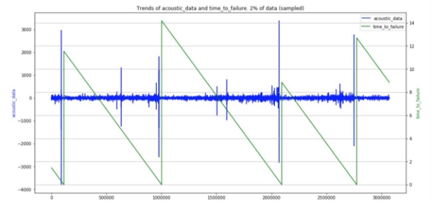

We will see the distribution of the acoustic data. We plotted this distribution for first 10000000 data points. Most of the points are positives and from this graph, we can interpret that most of the points are greater than zero. 

We will see the distribution of the time\_to\_failure. We plotted this distribution for first 10000000 data points.  

## Feature Engineering

“Feature  engineering  is  the  process  of  transforming raw  data into features that  better represent the  underlying  problem to the  predictive  models,  resulting  in  improved model accuracy on unseen data.” 

- Dr. Jason Brownlee 

We have created almost 20 statistical features from one feature acoustic data. We will explain to you some of the important features that we have generated in the following section. 

**Ave, std, max, min and sum**: These are some features which take the average, standard deviation, maximum value, minimum value and a sum of all the rows. These are used in various places like finding these parameters for first 50k points and last 50k points. 

**Median and Var:** We used median and variance values as one of the features. 

**Skew and Kurt:** Here skewness is the measure of the asymmetry of values acoustic data and kurtosis is a statistical measure that is used to describe the distribution of acoustic data. 

**Quantile:** In  statistics  and  probability, quantiles  are  cut  points  dividing  the  range  of  a[ probability distribution ](https://en.wikipedia.org/wiki/Probability_distribution)into continuous intervals with equal probabilities, or dividing the observations in a sample in the same way. Therefore, we are using 0.25, 0.50 and 0.75 quantiles of both acoustic data and for the absolute value of the acoustic data. 

**Change:** We have calculated the mean of the difference between consecutive values of x and we call this change. 

**Rolling  std,  max,  min,  and  sum:**  we  used  rolling  features  with  windown  size=3.Rolling  Standard Deviation, Rolling Max, Rolling Min, and Rolling Sum were calculated. 

Rolling Median, Rolling variance, rolling covariance were also calculated. 

**Step 1:** 

Breaking all 61.44 Crore data into 4 chunks of 153600000. 

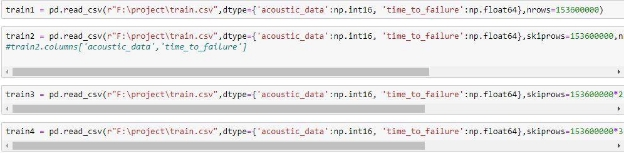

**Step 2:  **

Again dividing 153600000 data into 150000data rows i.e. 1024 chunks and adding features into train data sets. 

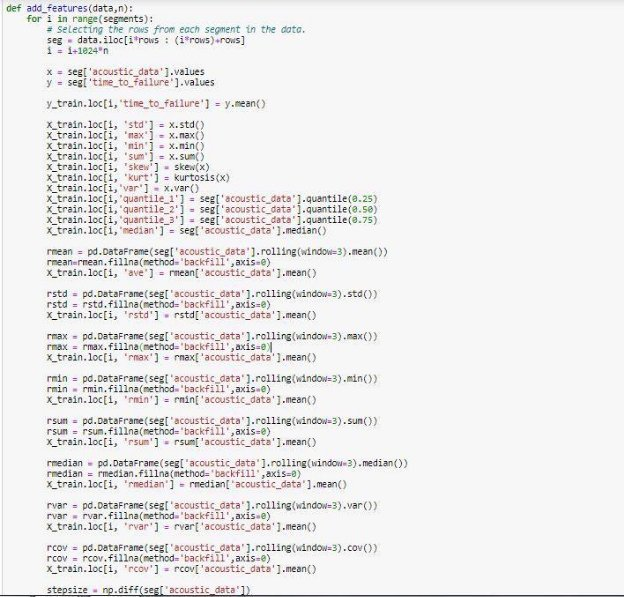

**Step 3: **

Adding features into test data sets 

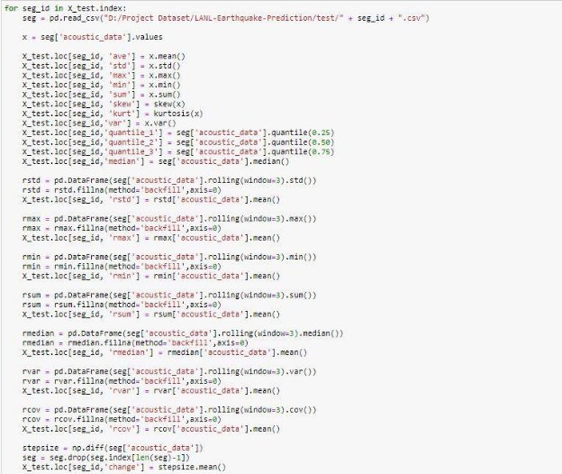

## Modeling

**Scikit Learn Based** 

1. Linear Regression 

Linear  regression  was  developed  in  the  field  of  statistics  and  is  studied  as  a  model  for understanding the relationship between input and output numerical variables, but has been borrowed by machine learning. It is both a statistical algorithm and a machine learning algorithm. 

Linear Regression is a machine learning algorithm based on supervised learning. Linear regression performs the task to predict a dependent variable value (y) based on a given independent variable (x). So, this regression technique finds out a linear relationship between x (input) and y(output). Hence, the name is Linear Regression. 

**Simple Linear Regression** 

With simple linear regression when we have a single input, we can use statistics to estimate the coefficients. This requires that you calculate statistical properties from the data such as means, standard deviations,  correlations  and  covariance.  All  of  the  data  must  be  available  to  traverse  and  calculate statistics. 

2. Support Vector Regression 

Support Vector Regression (SVR) is quite different from other Regression models. It uses the Support Vector Machine (SVM, a classification algorithm) algorithm to predict a continuous variable. While other linear regression models try to minimize the error between the predicted and the actual value, Support Vector Regression tries to fit the best line within a predefined or threshold error value. What SVR does in this sense, it tries to classify all the prediction lines in two types, ones that pass through the error boundary( space separated by two parallel lines) and ones that don’t. 

Those lines, which do not pass the error boundary, are not considered as the difference between the predicted value and the actual value has exceeded the error threshold, (epsilon). The lines that pass are considered for a potential support vector to predict the value of an unknown. The following diagram will help you to grab this concept. 

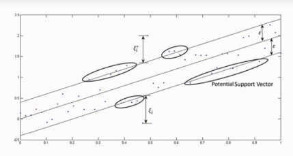

**Kernel:** Kernel is a function that is used to map a lower-dimensional data points into higher dimensional data points. As SVR performs linear regression in a higher dimension, this function is crucial. There are many types of kernel such as Polynomial Kernel, Gaussian Kernel, Sigmoid Kernel, etc. 

**Hyper Plane:** In Support Vector Machine, a hyperplane is a line used to separate two data classes in a higher  dimension  than  the  actual  dimension.  In  SVR,  a  hyperplane  is  a  line that  is  used  to  predict continuous value. 

**Boundary Line:** Two parallel lines drawn to the two sides of Support Vector with the error threshold value, (epsilon) are known as the boundary line. These lines create a margin between the data points. 

**Support Vector:** The line from which the distance is minimum or least from two boundary data points. The boundary is trying to fit as many instances as possible without violating the margin. The  error threshold (epsilon) controls the width of the boundary. In classification, the support vector X is used to define the hyper plane that separated the two different classes. Here, these vectors are used to perform linear regression. 

3. Decision Tree 

A decision tree is a tree-like graph with nodes representing the place where we pick an attribute and ask a question; edges represent the answers the to the question; and the leaves represent the actual output or class label. They are used in non-linear decision making with simple linear decision surface. 

Decision trees classify the examples by sorting them down the tree from the root to some leaf node, with the leaf node providing the classification to the example. Each node in the tree acts as a test case for some attribute, and each edge descending from that node corresponds to one of the possible answers to the test case. This process is recursive in nature and is repeated for every subtree rooted at the  new  nodes. 

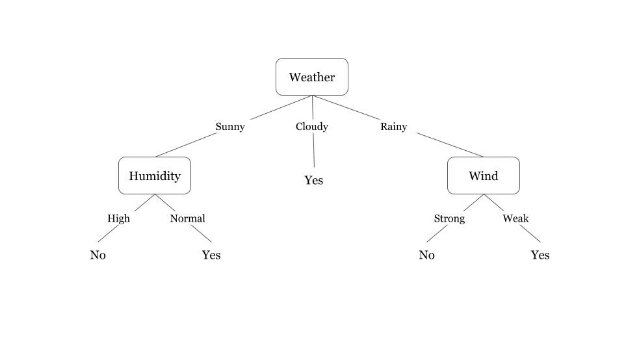

A tree is built by splitting the source[ set,](https://en.wikipedia.org/wiki/Set_\(mathematics\)) constituting the root node of the tree, into subsets - which  constitute  the  successor  children.  The  splitting  is  based  on  a  set  of  splitting  rules  based  on classification  features. This  process  is  repeated  on  each  derived  subset  in  a  recursive  manner called[ recursive partitioning.](https://en.wikipedia.org/wiki/Recursive_partitioning) The[ recursion ](https://en.wikipedia.org/wiki/Recursion)is completed when the subset at a node has all the same values of the target variable, or when splitting no longer adds value to the predictions. This process of top- down induction of decision trees (TDIDT) is an example of a[ greedy algorithm,](https://en.wikipedia.org/wiki/Greedy_algorithm) and it is by far the most common strategy for learning decision trees from data 

- [Classification tree ](https://en.wikipedia.org/wiki/Classification_tree)analysis is when the predicted outcome is the class (discrete) to which the data belongs. 
- Regression tree analysis is when the predicted outcome can be considered a real number (e.g. the price of a house, or a patient's length of stay in a hospital). 

` `**Gini Index:** 

- Gini Index is a metric to measure how often a randomly chosen element would be incorrectly identified. 
- It means an attribute with lower Gini index should be preferred. 
- Sklearn supports “Gini” criteria for Gini Index and by default, it takes “Gini” value. 
- The Formula for the calculation of the of the Gini Index is given below. 
4. Multilayer Perceptron Regressor (MLP) 

A multilayer perceptron (MLP) is a class of feed forward artificial neural network (ANN). The term MLP is used ambiguously, sometimes loosely to refer to any feed forward ANN, sometimes strictly to refer to  networks  composed  of  multiple  layers of perceptron (with  threshold  activation);  see terminology. Multilayer perceptrons are sometimes colloquially referred to as "vanilla" neural networks, especially when they have a single hidden layer. 

An MLP consists of at least three layers of nodes: an input layer, a hidden layer and an output layer. Except for the input nodes, each node is a neuron that uses a nonlinear[ activation function.](https://en.wikipedia.org/wiki/Activation_function) MLP utilizes a[ supervised learning ](https://en.wikipedia.org/wiki/Supervised_learning)technique called[ backpropagation ](https://en.wikipedia.org/wiki/Backpropagation)for training. Its multiple layers and non- linear activation distinguish MLP from a linear[ perceptron.](https://en.wikipedia.org/wiki/Perceptron) It can distinguish data that is not[ linearly separable.](https://en.wikipedia.org/wiki/Linear_separability) 

**Activation function:** 

If a multilayer perceptron has a linear[ activation function ](https://en.wikipedia.org/wiki/Activation_function)in all neurons, that is, a linear function that maps the[ weighted inputs ](https://en.wikipedia.org/wiki/Synaptic_weight)to the output of each neuron, then[ linear algebra ](https://en.wikipedia.org/wiki/Linear_algebra)shows that any number of  layers  can  be  reduced  to  a  two-layer  input-output  model.  In  MLPs,  some  neurons  use a nonlinear activation function that was developed to model the frequency of[ action potentials,](https://en.wikipedia.org/wiki/Action_potentials) or firing, of biological neurons. 

**Learning rate:** 

Learning occurs in the perceptron by changing connection weights after each piece of data is processed, based on the amount of error in the output compared to the expected result. This is an example of[ supervised learning,](https://en.wikipedia.org/wiki/Supervised_learning) and is carried out through[ backpropagation,](https://en.wikipedia.org/wiki/Backpropagation) a generalization of the[ least mean squares algorithm ](https://en.wikipedia.org/wiki/Least_mean_squares_filter)in the linear perceptron. 

5. Random Forest 

Random  forest  algorithm  is  a  supervised  classification  algorithm.  As  the  name  suggest,  this algorithm creates the forest with a number of trees. 

In general, the more trees in the forest the more robust the forest looks like. In the same way in the random forest classifier, the higher the number of trees in the forest gives the high accuracy results. 

**Why Random forest algorithm** 

The same random forest algorithm or the random forest classifier can use for both classification and the regression task. 

- Random forest classifier will handle the missing values. 
- When we have more trees in the forest, random forest classifier will not over fit the model. 
- Can model the random forest classifier for categorical values also. 

A random forest is a Meta estimator that fits a number of decision tree classifiers on various sub- samples of the dataset and uses averaging to improve the predictive accuracy and control over-fitting. The sub-sample size is always the same as the original input sample size but the samples are drawn with replacement if bootstrap=True (default). 

1. Pick N random records from the dataset. 
1. Build a decision tree based on these N records. 
1. Choose the number of trees you want in your algorithm and repeat steps 1 and 2. 
1. In case of a regression problem, for a new record, each tree in the forest predicts a value for Y (output). The final value can be calculated by taking the average of all the values predicted by all the trees in forest. Alternatively, in case of a classification problem, each tree in the forest predicts the category to which the new record belongs. Finally, the new record is assigned to the category that wins the majority vote. 

Random forest algorithm works well because it aggregates many decision trees, which reduce the effect of noisy results, whereas the prediction results of a single decision tree may be prone to noise. Random forest algorithm can be applied to build both classification and regression models. 

- In the case of a random forest classification model, each decision tree votes; then to get the final result, the most popular prediction class is chosen. 
- In the case of random forest regression model, the mean of all decision tree results is considered as the final result. 

**Random Forest Code:** 

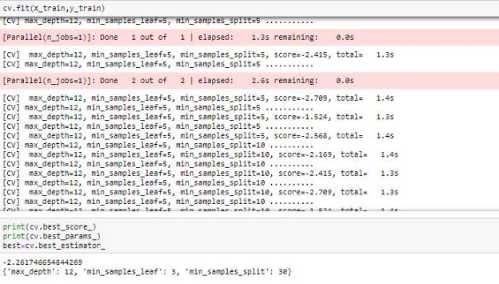

Best Parameters: 

- Maximum Depth=12 
- Minimum sample leaf=3 
- Minimum sample split=30 
6. XGBoost 

XGBoost is  a  decision-tree-based  ensemble  Machine  Learning  algorithm  that  uses  a gradient boosting framework. In prediction, problems involving unstructured data (images, text, etc.) artificial neural networks tend to outperform all other algorithms or frameworks. However, when it comes to small-to-medium structured/tabular data, decision tree based algorithms are considered best in class right now.  

XGBoost and Gradient Boosting Machines (GBMs) are both ensemble tree methods that apply the principle of boosting weak learners [(CARTs ](https://www.datasciencecentral.com/profiles/blogs/introduction-to-classification-regression-trees-cart)generally) using the gradient descent architecture. However, XGBoost  improves  upon  the  base  GBM  framework  through  systems  optimization  and  algorithmic enhancements. 

XGBoost was introduced because the gradient boosting algorithm was computing the output at a prolonged rate right because there is a sequential analysis of the data set and it takes a longer time 

XGBoost focuses on your speed and your model efficiency. To do this, XGBoost has a couple of features.  It  supports  parallelization  by  creating  decision  trees.  There  is  no  sequential  modeling  in computing methods for evaluating any large and any complex modules 

7. Long short-term memory Neural Network(RNN-LSTM) 

Long short-term memory (LSTM) is an artificial[ recurrent neural network ](https://en.wikipedia.org/wiki/Recurrent_neural_network)(RNN) architecture used in  the  field  of[ deep  learning.](https://en.wikipedia.org/wiki/Deep_learning)  Unlike  standard[ feedforward  neural  networks,](https://en.wikipedia.org/wiki/Feedforward_neural_network)  LSTM  has  feedback connections. It cannot only process single data points (such as images), but also entire sequences of data (such  as  speech  or  video).  For  example,  LSTM  is  applicable  to  tasks  such  as  unsegmented, connected[ handwriting recognition,](https://en.wikipedia.org/wiki/Handwriting_recognition)[ speech recognition ](https://en.wikipedia.org/wiki/Speech_recognition)and anomaly detection in network traffic or IDS's (intrusion detection systems). 

A common LSTM unit is composed of a cell, an input gate, an output gate and a forget gate. The cell remembers values over arbitrary time intervals and the three gates regulate the flow of information into and out of the cell. 

LSTM networks are well-suited to[ classifying,](https://en.wikipedia.org/wiki/Classification_in_machine_learning)[ processing ](https://en.wikipedia.org/wiki/Computer_data_processing)and[ making predictions ](https://en.wikipedia.org/wiki/Predict)based on[ time series ](https://en.wikipedia.org/wiki/Time_series)data, since there can be lags of unknown duration between important events in a time series. LSTMs were developed to deal with the exploding and[ vanishing gradient problems ](https://en.wikipedia.org/wiki/Vanishing_gradient_problem)that can be encountered when  training  traditional  RNNs.  Relative  insensitivity  to  gap  length  is  an  advantage  of  LSTM  over RNNs,[ hidden Markov models ](https://en.wikipedia.org/wiki/Hidden_Markov_models)and other sequence learning methods in numerous applications 

Long Short-Term Memory (LSTM) networks are a type of recurrent neural network capable of learning order dependence in sequence prediction problems. This is a behavior required in complex problem domains like machine translation, speech recognition, and more. LSTMs are a complex area of deep learning. It can be hard to get your hands around what LSTMs are, and how terms like bidirectional and sequence-to-sequence relate to the field. 

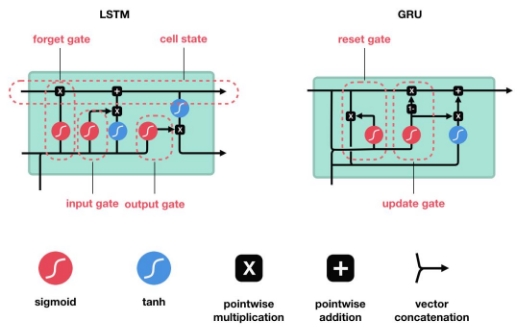

These gates can learn which data in a sequence is important to keep or throw away. By doing that, it can pass relevant information down the long chain of sequences to make predictions. Almost all state of the art results based on recurrent neural networks are achieved with these two networks. LSTM’s and GRU’s can be found in speech recognition, speech synthesis, and text generation. You can even use them to generate captions for videos. 

8. Voting 

Voting is one of the simplest way of combining the predictions from multiple machine learning algorithms. Voting classifier is not an actual classifier but a wrapper for set of different ones that are trained and valuated in parallel in order to exploit the different peculiarities of each algorithm. 

We can train data set using different algorithms and ensemble then to predict the final output. The final output on a prediction is taken by majority vote according to two different strategies 

1. **Hard voting / Majority voting:** Hard voting is the simplest case of majority voting. In this case, the class that received the highest number of votes NC(yt) will be chosen. We predict the class label y^ via majority voting of each classifier. 
1. **Soft voting:** In this case, the probability vector for each predicted class (for all classifiers) are summed up & averaged. The winning class is the one corresponding to the highest value (only recommended if the classifiers are well calibrated). 

\9.  Stacking

Stacking is a way to ensemble multiple classifications or regression model. Stacking (sometimes called Stacked Generalization) is a different paradigm. The point of stacking is to explore a space of different models for the same problem. The idea is that you can attack a learning problem with different types of models which are capable to learn some part of the problem, but not the whole space of the problem.  Therefore  build  multiple  different  learners  and  you  use  them  to  build  an  intermediate prediction,  one  prediction  for  each  learned  model.  Then  add  a  new  model,  which  learns  from  the intermediate predictions the same target 

This final model is said to be stacked on the top of the others, hence the name. Thus, it might improve  overall  performance,  and  often  end  up  with  a  model,  which  is  better  than  any  individual intermediate model. Notice however, that it does not give any guarantee, as is often the case with any machine learning technique. 

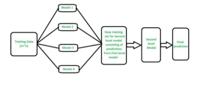

**H2O Based **

H2O is an open source, in-memory, distributed, fast, and scalable machine learning and predictive analytics platform that allows you to build  machine-learning models on big data and provides easy production of those models in an enterprise environment. 

H2O’s core code is written in Java. Inside H2O, a Distributed Key/Value store is used to access and reference data, models, objects, etc., across all nodes and machines. The algorithms are implemented on top of H2O’s distributed Map/Reduce framework and utilize the Java Fork/Join framework for multi- threading. 

The fork-join framework allows breaking a certain task on several workers and then waiting for the result to combine them. It leverages multi-processor machine's capacity to great extent 

The data is read in parallel and is distributed across the cluster and stored in memory in a columnar format in a compressed way. H2O’s data parser has built-in intelligence to guess the schema of the incoming dataset and supports data ingest from multiple sources in various formats 

This is a local H2O cluster. On executing the cell, some information will be printed on the screen in a tabular format displaying amongst other things, the number of nodes, total memory, Python version etc. In case you need to report a bug, make sure you include all this information. Also, the h2o.init () makes sure that no prior instance of H2O is running.** 

By default, H2O instance uses all the cores and about 25% of the system’s memory. However, in case you wish to allocate it a fixed chunk of memory, you can specify it in the init function. Let us say we want to give the H2O instance 4GB of memory and it should only use two cores. 

**#Allocate resources h2o.init(nthreads=2,max\_mem\_size=4)** 

**Getting Data into Your H2O Cluster:** 

The  first  step  toward  building  and  scoring  your  models  is  getting  your  data  into  the  H2O cluster/Java process that is running on your local or remote machine. Whether you are importing data, uploading data, or retrieving data from HDFS or S3, be sure that your data is compatible with H2O. 

**Supported File Formats:** 

H2O currently supports the following file types: 

- CSV (delimited) files (including GZipped CSV) 
- ORC 
- SVMLight 
- ARFF 
- XLS (BIFF 8 only) 
- XLSX (BIFF 8 only) 
- Avro version 1.8.0 (without multifile parsing or column type modification) & Parquet 

**Data Sources: **

H2O supports data ingest from various data sources. Natively, a local file system, remote file systems, HDFS, S3, and some relational databases are supported. Additional data sources can be accessed through a generic HDFS API, such as Alluxio or OpenStack Swift. 

Default Data Sources: 

- Local File System 
- Remote File 
- JDBC 
- Hive 
- S3 

Now our H2O instance is using only 2 cores and around 4GB of memory. However, we will go with the default method 

1. Generalized Linear Model (GLM) 

Generalized Linear Models (GLM) estimate regression models for outcomes following exponential distributions. In addition to the Gaussian (i.e. normal) distribution, these include Poisson, binomial, and gamma distributions. When GLM performs regression (with factor columns), one category can be left out to avoid multi collinearity. If regularization is disabled (lambda = 0), then one category is left out. However, when using a default lambda parameter, all categories are included. 

2. Deep Learning (Neural Networks) 

H2O’s Deep Learning is based on a multi-layer[ feedforward artificial neural network ](https://en.wikipedia.org/wiki/Feedforward_neural_network)that is trained with stochastic gradient descent using back-propagation. The network can contain a large number of hidden  layers  consisting  of  neurons  with  tanh,  rectifier,  and maxout  activation  functions.  Advanced features  such  as  adaptive  learning  rate,  rate  annealing,  momentum  training,  dropout,  L1  or  L2 regularization, check pointing, and grid search enable high predictive accuracy 

A feedforward artificial neural network (ANN) model, also known as deep neural network (DNN) or multi-layer perceptron (MLP), is the most common type of Deep Neural Network and the only type that is supported natively in H2O-3. Several other types of DNNs are popular as well, such as Convolutional Neural  Networks  (CNNs)  and  Recurrent  Neural  Networks  (RNNs).  MLPs  work  well  on  transactional (tabular) data; however if you have image data, then CNNs are a great choice. If you have sequential data (e.g. text, audio, time-series), then RNNs are a good choice 

3. Gradient Boosting Machine (GBM) 

Gradient Boosting Machine (for Regression and Classification) is a forward learning ensemble method. The guiding heuristic is that good predictive results can be obtained through increasingly refined approximations. H2O’s GBM sequentially builds regression trees on all the features of the dataset in a fully distributed way - each tree is built in parallel. 

4. XGBoost 

XGBoost is a supervised learning algorithm that implements a process called boosting to yield accurate  models.  Boosting  refers  to  the  ensemble  learning  technique  of  building  many  models sequentially, with each new model attempting to correct for the deficiencies in the previous model. In tree boosting, each new model that is added to the ensemble is a decision tree. XGBoost provides parallel tree boosting (also known as GBDT, GBM) that solves many data science problems in a fast and accurate way. For many problems, XGBoost is one of the best gradient boosting machine (GBM) frameworks today. 

5. Distributed Random Forest (DRF) 

Distributed Random Forest (DRF) is a powerful classification and regression tool. When given a set of data, DRF generates a forest of classification or regression trees, rather than a single classification or regression tree. Each of these trees is a weak learner built on a subset of rows and columns. More trees will reduce the variance. Both classification and regression take the average prediction over all of their trees to make a final prediction, whether predicting for a class or numeric value. 

6. Stacked Ensembles 

Ensemble machine learning methods use multiple learning algorithms to obtain better predictive performance than could be obtained from any of the constituent learning algorithms. Many of the popular modern machine learning algorithms are actually ensembles. For example,[ Random Forest ](http://docs.h2o.ai/h2o/latest-stable/h2o-docs/data-science/drf.html)and[ Gradient Boosting Machine (GBM) ](http://docs.h2o.ai/h2o/latest-stable/h2o-docs/data-science/gbm.html)are both ensemble learners. Both bagging (e.g. Random Forest) and boosting (e.g. GBM) are methods for ensembling that take a collection of weak learners (e.g. decision tree) and form a single, strong learner. 

H2O’s Stacked Ensemble method is supervised ensemble machine learning algorithm that finds the optimal combination of a collection of prediction algorithms using a process called stacking. Like all supervised models in H2O, Stacked Ensemeble supports regression, binary classification and multiclass classification. 

## Conclusion

Throughout the project, we created seven individual sets of train data based on segment size (Number of rows) and by using fourteen different algorithms against these train sets, we build various Machine Learning models. Altogether, we were able to produce 30+ submissions of output. Starting from the Mean Absolute Error score of 8.10873 and a rank 4509 we progressed to Mean Absolute Score of 2.60544 and were able to achieve a rank 2021 with the best modeling algorithm as Random Forest combined with segment size of two Lakh. 

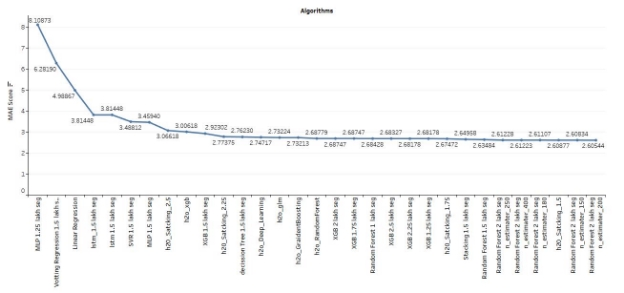

## Future Scope

1. Spark ML algorithms with Parallel processing 

Spark ML is a new package introduced in Spark 1.2, which aims to provide a uniform set of high- level APIs that help users create and tune practical machine learning pipelines. It is currently an alpha component 

2. Dask  

[Dask ](https://dask.pydata.org/)is a parallel computing library that allows either us to run many computations at the same time, using processes/threads on one machine (local), or many separate computers (cluster). For a single machine, Dask allows us to run computations in parallel using either threads or processes. 

3. H2O4GPU 

H2O4GPU is a collection of GPU solvers by[ H2Oai ](https://www.h2o.ai/)with APIs in Python and R. The Python API builds upon the easy-to-use[ scikit-learn ](http://scikit-learn.org/)API and its well-tested CPU-based algorithms. It can be used as a drop- in replacement for scikit-learn (i.e. import h2o4gpu as sklearn) with support for GPUs on selected (and ever-growing) algorithms. H2O4GPU inherits all the existing scikit-learn algorithms and falls back to CPU algorithms when the GPU algorithm does not support an important existing scikit-learn class option.  

4. H2O with Spark 

Sparkling Water allows users to combine the fast, scalable machine learning algorithms of H2O with the capabilities of Spark. Spark is an elegant and powerful general-purpose, open-source, in-memory platform with tremendous  momentum.  H2O  is  an  in-memory  platform  for machine  learning that  is reshaping how people apply math and predictive analytics to their business problems. Integrating these two open-source environments provides a seamless experience for users who want to make a query using Spark SQL, feed the results into H2O to build a model and make predictions, and then use the results again in Spark. For any given problem, better interoperability between tools provides a better experience. 
Earthquake Prediction  Page 24 
